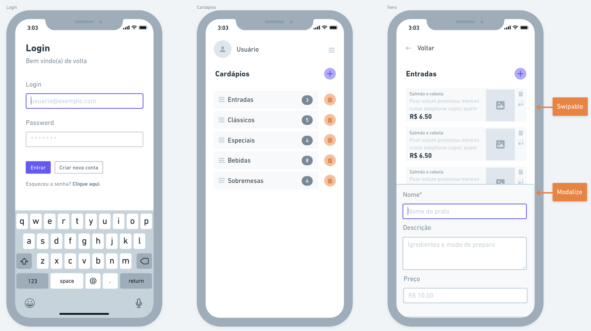

# Projeto de Desenvolvimento Mobile


## Sumário

- [Descrição](#descrição)
- [Bibliotecas](#bibliotecas)
- [Execução](#execução)
- [Projetos](#releases)
- [Citações](#citações)
- [Referências](#referências)

## Descrição

Este projeto contém um protótipo simples de um aplicativo construído com React Native (Expo). Em linhas gerais o aplicativo é destinado à organização de cardápios para restaurantes. A interface pretendida é esta abaixo.



Para completar o produto, uma segunda interface deve ser criada para que usuários comuns acessem o cardápio. Esta interface não está presente aqui pois acredita-se que deva ser feita uma interface para Web.

## Bibliotecas

Estaremos usando as seguintes bibliotecas:

- Axios
- Expo-Fonts
- React Native Icons
- Modalize

```sh
npm install axios
npm install expo-fonts
npm install react-native-vector-icons
```

A instalação do [Modalize](https://jeremybarbet.github.io/react-native-modalize/#/INSTALLATION) não é tão trivial, por favor siga o link.

## Execução

```sh
expo start
```

## Backend

Este repostitório faz uso de um APIs construída em NodeJS e que está disponível no [Link](https://github.com/vauxgomes/restaurant-menu-management-backend)

## Citações

Caso queira citar este projeto:

```bibtex
@software{GomesVaux2022,
    author = {Gomes, Vaux Sandino Diniz},
    month = {9},
    title = {{Restaurant Menu Manager Frontend}},
    version = {1.0.0},
    year = {2022}
}
```

## Referências
- [Instalando o Expo](https://docs.expo.dev/get-started/installation/)
- [Criando um projeto com Expo](https://docs.expo.dev/get-started/create-a-new-app/)
- [Usando Fonts com Expo](https://docs.expo.dev/guides/using-custom-fonts/)
- [Ícones no React Native](https://developerplus.com.br/como-usar-icones-com-react-native-vector-icons-no-react-native/)
